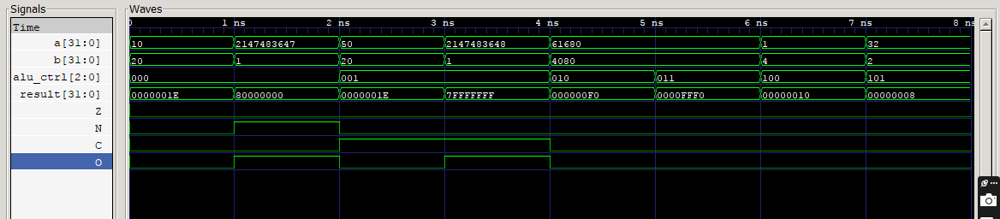

# Nanosheet-Aware Parameterized ALU

## Overview
This project implements a clean, modular, and parameterized Arithmetic Logic Unit (ALU) in Verilog.  
The design is intended to be scalable and suitable for modern CMOS technology nodes, where nanosheet-based transistors are becoming mainstream.

The primary focus is on:
- RTL architecture quality
- Parameterization and scalability
- Verification-ready design
- Industry-style code organization

Device-level characteristics typical of nanosheet technologies are considered at an abstraction level to guide architectural and timing-related design choices.

## Key Features
- Parameterized bit-width (configurable at compile time)
- Modular RTL design (adder, logic unit, shifter, comparator)
- Clean ALU top-level integration
- Structured testbench (in progress)
- Extensible toward synthesis and physical design flows

## Technology Assumptions
While this is an RTL-focused project, the design assumptions align with nanosheet-era CMOS characteristics such as:
- High drive current capability
- Improved electrostatic control
- Suitability for low-voltage operation

These assumptions are reflected through configurable RTL parameters rather than process-specific modeling.

## Repository Structure
- `rtl/` – Verilog RTL source files
- `tb/` – SystemVerilog testbench
- `docs/` – Architecture and design rationale
- `scripts/` – Simulation helpers
- `progress_log.md` – Development log

## Current Status
Initial project setup and architecture definition are complete.  
RTL module development and verification are in progress.
Supported operations table
Flags behavior description
Simulation instructions

## Future Scope
- Synthesis and timing analysis using standard EDA flows
- Parameter exploration for performance and power trade-offs
- Extension toward backend-aware design constraints

## Simulation & Verification

The following GTKWave snapshot demonstrates functional verification of the
RTL-based ALU. Multiple operations are applied sequentially through the
testbench, and the waveform confirms correct behavior of:

- Arithmetic operations (ADD, SUB)
- Logical operations (OR)
- Shift operations
- Status flags: Zero, Negative, Carry, Overflow

